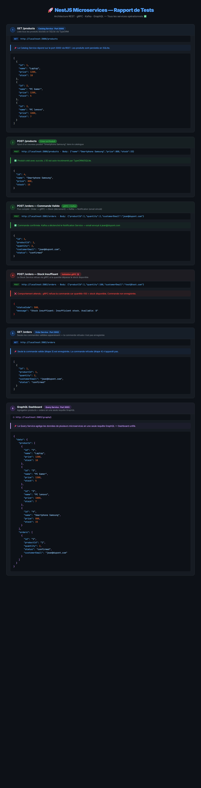
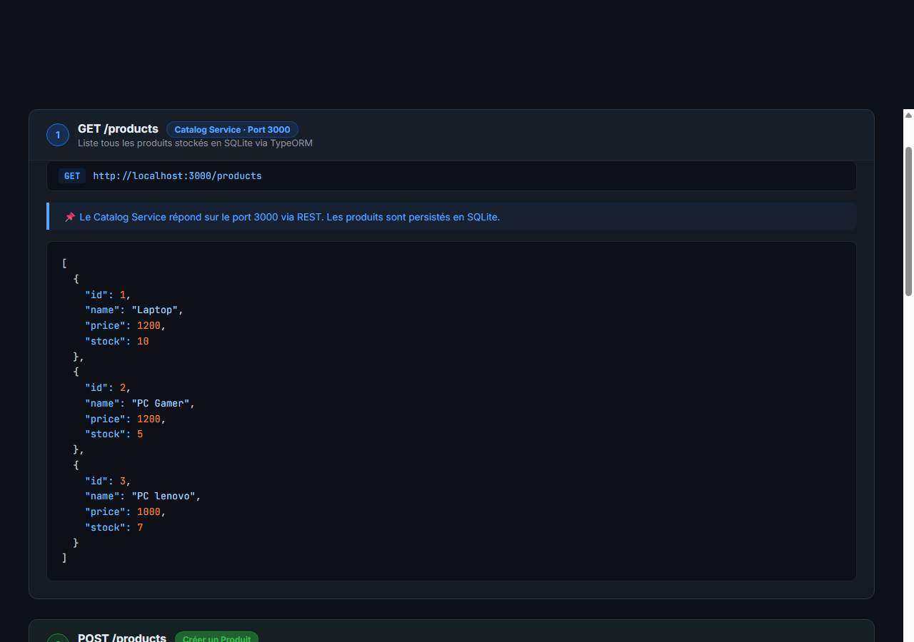
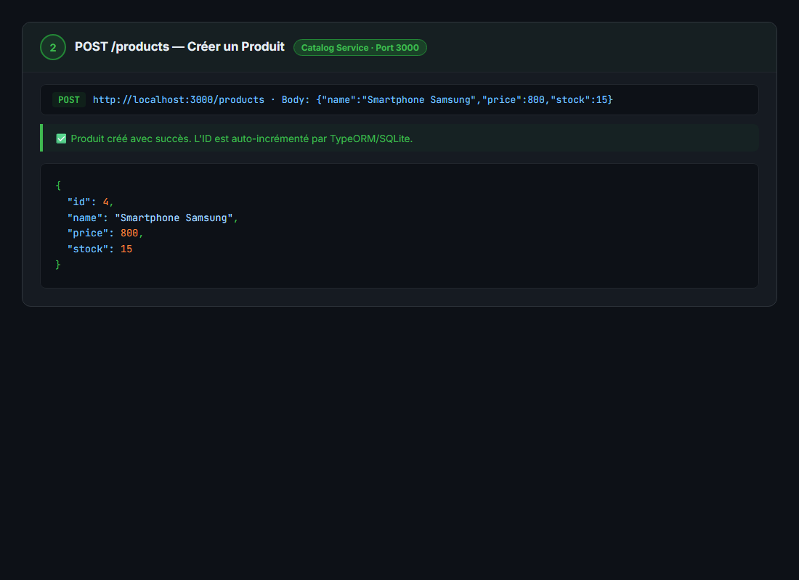
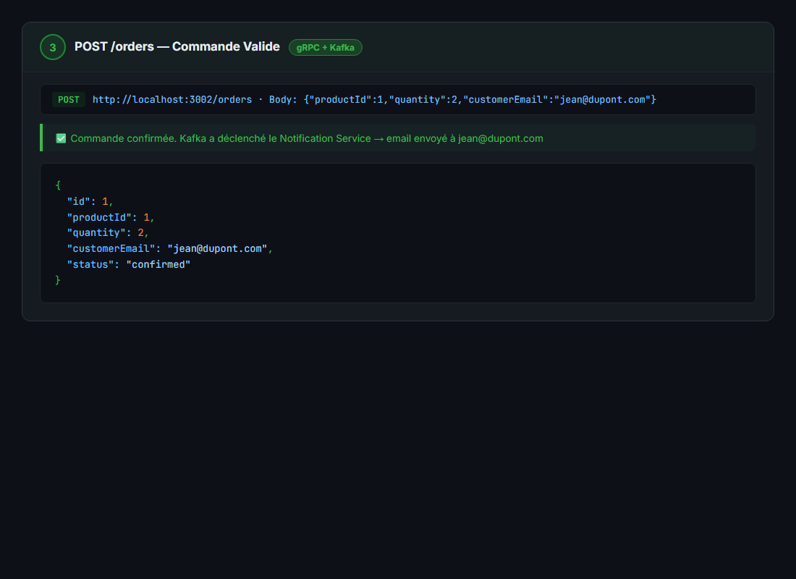
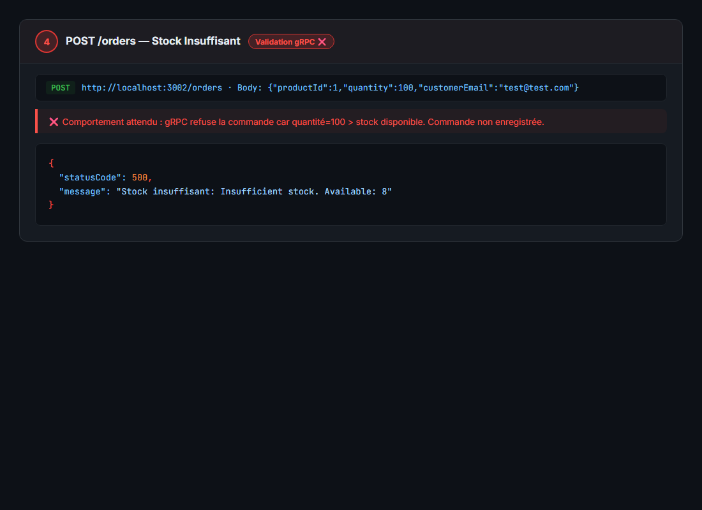
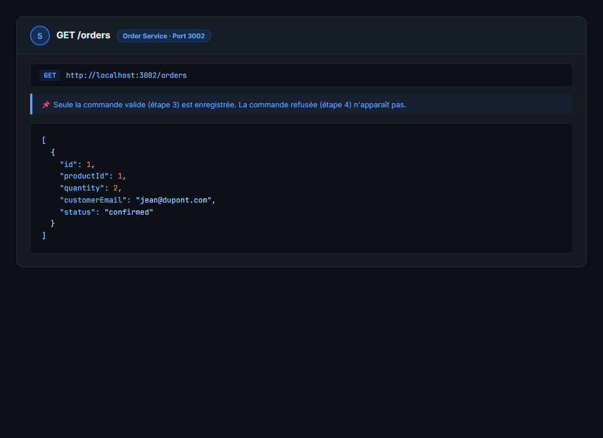
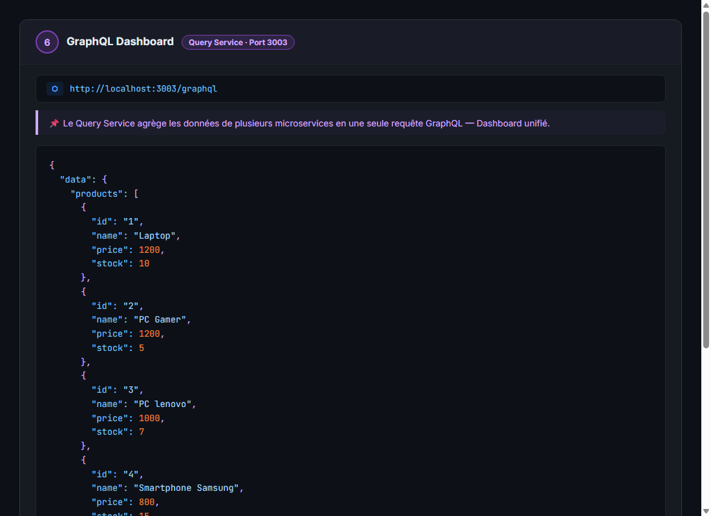

# 🚀 E-Commerce Microservices Architecture (NestJS)

Ce projet implémente une architecture complète basée sur les microservices pour simuler un système de commerce électronique. Il est construit avec le framework **NestJS** et utilise différentes méthodes de communication (REST, gRPC, Kafka, GraphQL) adaptées aux besoins spécifiques de chaque service.

## 🏗️ Architecture du Projet

L'application est découpée en 5 microservices indépendants :

1. **📦 Catalog Service (REST - Port 3000)** : Gère le catalogue des produits (Création, lecture, mise à jour, suppression).
2. **🛒 Order Service (REST - Port 3002)** : Gère la création des commandes clients. Lors d'une commande, il communique en temps réel avec le *Stock Service* via gRPC pour valider la disponibilité.
3. **🏭 Stock Service (gRPC - Port 50051)** : Service ultra-rapide qui vérifie et décrémente les stocks des produits. S'il n'y a pas assez de stock, la commande est refusée.
4. **📧 Notification Service (Kafka)** : Écoute les événements de validation publiés par l'*Order Service* de manière asynchrone pour simuler l'envoi d'e-mails de confirmation de commande, évitant ainsi de ralentir le processus de paiement.
5. **📊 Query Service (GraphQL - Port 3003)** : Fournit un point d'accès unifié (GraphQL) permettant d'interroger la liste des produits et des commandes via une seule requête, jouant le rôle de Dashboard.

## 🛠️ Technologies Utilisées

- **Framework Backend :** NestJS (TypeScript)
- **Base de données :** SQLite (via TypeORM)
- **Communications Synchrones :** API REST & gRPC
- **Communication Asynchrone :** Apache Kafka (Event-Driven Architecture)
- **API d'Agrégation :** GraphQL (Apollo Server)
- **Infrastructure :** Docker & Docker Compose (Zookeeper & Kafka)

---

## 🚀 Comment lancer le projet ?

### 1. Démarrer l'infrastructure (Docker)
Assurez-vous que Docker Desktop est ouvert, puis lancez Kafka et Zookeeper depuis la racine du projet :
```bash
docker-compose up -d
```

### 2. Démarrer les Microservices
Ouvrez **5 terminaux distincts** et lancez chaque service dans son propre environnement de développement :
```bash
# Terminal 1
cd catalog-service && npm run start:dev

# Terminal 2
cd order-service && npm run start:dev

# Terminal 3
cd stock-service && npm run start:dev

# Terminal 4
cd notification-service && npm run start:dev

# Terminal 5
cd query-service && npm run start:dev
```

---

## 🧪 Résultats des Tests (Scénario de Validation Complet)

> Tests exécutés avec tous les services opérationnels. ✅ = Succès | ❌ = Erreur attendue (comportement correct)

**Capture des résultats complets :**


---

### ✅ Étape 1 — GET /products (Catalog Service - Port 3000)

**Requête :**
```bash
curl http://localhost:3000/products
```

**Réponse :**
```json
[
  { "id": 1, "name": "Laptop",    "price": 1200, "stock": 10 },
  { "id": 2, "name": "PC Gamer",  "price": 1200, "stock": 5  },
  { "id": 3, "name": "PC lenovo", "price": 1000, "stock": 7  }
]
```
> 📌 Le Catalog Service répond sur le port 3000 via REST. Les produits sont persistés en SQLite.

**Capture de validation :**


---

### ✅ Étape 2 — POST /products (Créer un nouveau produit)

**Requête :**
```bash
curl -X POST http://localhost:3000/products \
     -H "Content-Type: application/json" \
     -d '{"name":"Smartphone Samsung","price":800,"stock":15}'
```

**Réponse :**
```json
{ "id": 4, "name": "Smartphone Samsung", "price": 800, "stock": 15 }
```
> 📌 Produit créé avec succès. L'ID est auto-incrémenté par TypeORM/SQLite.

**Capture de validation :**


---

### ✅ Étape 3 — POST /orders (Commande valide — gRPC + Kafka)

**Requête :**
```bash
curl -X POST http://localhost:3002/orders \
     -H "Content-Type: application/json" \
     -d '{"productId":1,"quantity":2,"customerEmail":"jean@dupont.com"}'
```

**Réponse :**
```json
{ "id": 1, "productId": 1, "quantity": 2, "status": "confirmed", "customerEmail": "jean@dupont.com" }
```

**Log Notification Service (Terminal 4) :**
```
[Nest] LOG [ServerKafka] Consumer has joined the group
Notification service listening on Kafka
✉️  Email de confirmation envoyé à jean@dupont.com — Commande #1 validée !
```
> 📌 Flux complet : Order Service → gRPC → Stock Service (décrément stock) → Kafka → Notification Service (email simulé).

**Capture de validation :**


---

### ❌ Étape 4 — POST /orders (Stock insuffisant — Validation gRPC)

**Requête :**
```bash
curl -X POST http://localhost:3002/orders \
     -H "Content-Type: application/json" \
     -d '{"productId":1,"quantity":100,"customerEmail":"test@test.com"}'
```

**Réponse :**
```json
{ "statusCode": 500, "message": "Stock insuffisant: Insufficient stock. Available: 8" }
```
> 📌 La validation gRPC fonctionne correctement. Le Stock Service refuse la commande car la quantité demandée (100) dépasse le stock disponible (8). La commande n'est pas enregistrée.

**Capture de validation :**


---

### ✅ Étape 5 — GET /orders (Order Service - Port 3002)

**Requête :**
```bash
curl http://localhost:3002/orders
```

**Réponse :**
```json
[
  {
    "id": 1,
    "productId": 1,
    "quantity": 2,
    "status": "confirmed",
    "customerEmail": "jean@dupont.com"
  }
]
```
> 📌 Seule la commande valide (étape 3) est enregistrée. La commande refusée (étape 4) n'apparaît pas.

**Capture de validation :**


---

### ✅ Étape 6 — GraphQL Dashboard (Query Service - Port 3003)

**Requête :**
```graphql
query {
  products { id name price stock }
  orders { id productId quantity status customerEmail }
}
```

**URL :** [http://localhost:3003/graphql](http://localhost:3003/graphql)

**Réponse :**
```json
{
  "data": {
    "products": [
      { "id": "1", "name": "Laptop",              "price": 1200, "stock": 10 },
      { "id": "2", "name": "PC Gamer",             "price": 1200, "stock": 5  },
      { "id": "3", "name": "PC lenovo",            "price": 1000, "stock": 7  },
      { "id": "4", "name": "Smartphone Samsung",   "price": 800,  "stock": 15 }
    ],
    "orders": [
      {
        "id": "1",
        "productId": "1",
        "quantity": 2,
        "status": "confirmed",
        "customerEmail": "jean@dupont.com"
      }
    ]
  }
}
```
> 📌 Le Query Service agrège les données de plusieurs microservices en **une seule requête GraphQL**. C'est le rôle du Dashboard unifié.

**Capture de validation (GraphQL) :**


---

## 🔧 Correction Apportée

Un bug a été identifié et corrigé dans le `stock-service` :

- **Problème :** Le décorateur `@GrpcMethod` était placé dans un `Service` (provider) au lieu d'un `Controller`. NestJS gRPC ne découvrait pas le handler → erreur `UNIMPLEMENTED (code 12)`.
- **Fix :** Création d'un `StockController` qui expose le handler gRPC et délègue la logique métier au `StockService`. Le module a été mis à jour pour enregistrer le controller.
- **Fix 2 :** Les champs `int64` du proto gRPC peuvent arriver en JavaScript sous forme d'objet `Long` ou de chaîne. Ajout de `Number()` pour garantir la compatibilité avec les clés numériques de la Map en mémoire.

---

## 📊 Résumé des Services

| Service | Transport | Port | Status |
|---------|-----------|------|--------|
| catalog-service | REST (HTTP) | 3000 | ✅ |
| order-service | REST (HTTP) | 3002 | ✅ |
| stock-service | gRPC | 50051 | ✅ |
| notification-service | Kafka Consumer | — | ✅ |
| query-service | GraphQL | 3003 | ✅ |
| Kafka + Zookeeper | Docker | 9092 / 2181 | ✅ |
